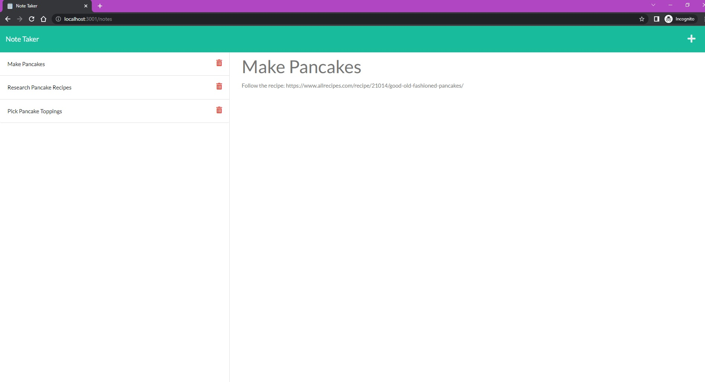

**Project Title:**

Dynamic Note Taker

---

**Project Description/Summary:**

An application that can be used to write and save notes - this uses an Express.js back end and a will save and retrieve note data from a JSON file. 

As a bonus: this site can also handle delete functionality - after you create a note, simply click the red trash can icon next to it and it will be deleted.

---

**Live Site:**

Check out the Heroku site here!

https://sheltered-harbor-43824.herokuapp.com

---

**Technology Used:**

- JavaScript
- HTML
- CSS
- Bootstrap
- Express.js
- UUID
- Heroku

---

**Installation:**

You can view the site from the Heroku link. 

Alternatively, you can run with the npm start command in the terminal. This will run the site on your local host (e.g. localhost:3001). Navigate there and interact with the site! 

---

**Screenshot:**

